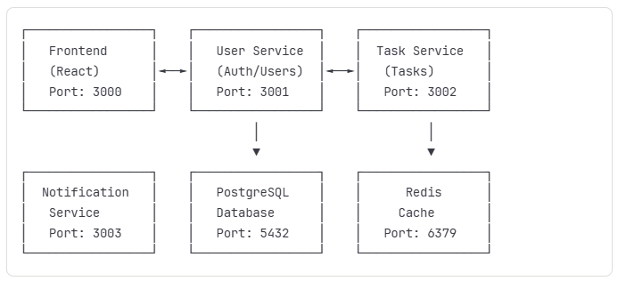

# what-to-do
A modern, scalable task management application built with microservices architecture, featuring user authentication, task management, automated notifications, and a responsive React frontend.

# Features

<ul>
    <li>Secure Authentication - JWT-based user registration and login</li>
    <li>Complete Task Management - Create, update, delete, and organize tasks</li>
    <li>Due Date Tracking - Set deadlines and priority levels</li>
    <li>Smart Notifications - Automated email reminders for overdue tasks</li>
    <li>Responsive Design - Works seamlessly on desktop and mobile</li>
    <li>Real-time Updates - Instant synchronization across the application</li>
    <li>Monitoring Ready - Built-in metrics and health checks</li>
</ul>

This application demonstrates microservices design patterns with four independent services:

# Quick Start

# Prerequisites
<ul>
    <li>Node.js (v18 or higher)</li>
    <li>Docker and Docker Compose</li>
    <li>Git</li>
</ul>

1. Clone the Repository

2. Environment Setup

3. Start with Docker Compose

4. Access the Application

<ul>
    <li>Web Application: http://localhost:3000</li>
    <li>API Documentation: Available at each service's /health endpoint</li>
</ul>

# Docker Deployment

Build and Run

Production Build

# Kubernetes Deployment

Prerequisites

<ul>
    <li>kubectl installed and configured</li>
    <li>Local Kubernetes cluster (Minikube, Kind, or Docker Desktop)</li>
</ul>

Deploy to Kubernetes

Scaling in Kubernetes

# Monitoring

Health Checks

# API Documentation

User Service (http://localhost:3001/api/users)

Task Service (http://localhost:3002/api/tasks)

Notification Service (http://localhost:3003/api/notifications)

# Tech Stack

Frontend
<ul>
    <li>React 18 with TypeScript</li>
    <li>Tailwind CSS for styling</li>
    <li>Axios for HTTP requests</li>
    <li>React Router for navigation</li>
</ul>

Backend
<ul>
    <li>Node.js with Express</li>
    <li>JWT for authentication</li>
    <li>bcryptjs for password hashing</li>
    <li>Helmet for security headers</li>
</ul>

Database
<ul>
    <li>PostgreSQL 15 (Primary database)</li>
    <li>Redis 7 (Caching and sessions)</li>
</ul>

DevOps
<ul>
    <li>Docker for containerization</li>
    <li>Kubernetes for orchestration</li>
    <li>Prometheus for metrics</li>
    <li>Grafana for visualization</li>
</ul>